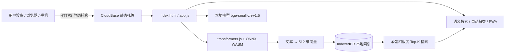

# 收藏大脑 · Collection Brain

> 一个**完全运行在浏览器里**的语义搜索应用 —— 无需后端服务器，零部署成本，手机可直接「添加到主屏幕」当 App 用。


---

## ✨ 功能特性

- 🔍 **语义搜索**：基于中文文本向量（embedding）的相似度检索，而非简单关键词匹配
- 🏷️ **自动归类**：新增笔记时，根据与已有内容的语义距离，自动归入最相近的分类
- 📱 **移动优先 + PWA**：可「添加到主屏幕」变成 App，支持离线使用
- 🆓 **零后端**：所有计算在浏览器端通过 WASM 完成，不依赖任何服务器
- 💾 **本地优先**：数据存于 IndexedDB，首次加载后离线也能用；隐私数据不出本机

---

## 🛠 技术栈

| 领域     | 技术                                                                                     |
| ------ | -------------------------------------------------------------------------------------- |
| 前端     | 原生 HTML / CSS / JavaScript（无框架、零构建步骤）                                                  |
| 端侧机器学习 | [transformers.js](https://github.com/xenova/transformers.js) + ONNX Runtime Web (WASM) |
| 嵌入模型   | `BAAI/bge-small-zh-v1.5`（512 维中文句向量，INT8 量化）                                           |
| 向量检索   | 浏览器内余弦相似度（Top-K）                                                                       |
| 本地存储   | IndexedDB（文档 + 向量缓存）                                                                   |
| 部署     | CloudBase 静态托管（Serverless，免费套餐）                                                        |
| 应用形态   | PWA（Web App Manifest + Service Worker）                                                 |

---

## 🏗 架构



**核心数据流：**

1. 用户首次访问，浏览器下载并缓存应用外壳与量化模型（约 24 MB，仅首次）
2. 任意文本经 `bge-small-zh-v1.5` 在 WASM 中推理，得到 512 维向量
3. 检索时，将查询向量与 IndexedDB 中已存向量的余弦相似度排序，返回 Top-K
4. 新增笔记时，用最近邻（Nearest-Neighbor）从种子分类中推断 `type`（自动归类）

---

## 💡 为什么是纯前端？（架构决策）

项目最初版本是一个 Python 后端（Flask + FastEmbed），需要对收藏内容做嵌入与检索。  
但它要求一个**常驻服务器**（CloudBase 云托管约 ¥50/月），且体验版环境不支持。

于是做了一次架构重写：

|      | 旧方案（Python 后端） | 新方案（纯前端 / 端侧推理）  |
| ---- | -------------- | ---------------- |
| 计算位置 | 云端服务器          | **用户浏览器 (WASM)** |
| 运行成本 | ≈ ¥50 / 月      | **¥0**           |
| 部署形态 | 容器 + 云托管       | 静态文件             |
| 数据隐私 | 数据上云           | **数据留本地**        |
| 离线可用 | 否              | **是**            |

> 这次「被迫」的重构，反而让项目在 **成本、隐私、离线** 三个维度全面优于原方案 ——  
> 也是这个项目最值得在面试中展开讲的**设计权衡**。

---

## 🚀 本地运行

```bash
# 1. 获取大体积资源（模型 + wasm，约 55 MB，克隆后首次需要）
python scripts/fetch_assets.py

# 2. 启动任意静态服务器
python -m http.server 8000
#   或使用  npx serve  /  VSCode Live Server

# 3. 浏览器打开
#   http://localhost:8000
```

> ⚠️ 不能直接双击 `index.html` 用 `file://` 打开 —— Service Worker 与 ES Module 需要 HTTP 协议。

---

## 📁 项目结构

```
收藏大脑-web/
├── index.html              # 应用入口（移动优先 UI）
├── styles.css              # 样式
├── app.js                  # 核心逻辑：CloudBase 匿名登录 + 模型加载 + 检索 + 自动归类
├── manifest.webmanifest    # PWA 配置
├── sw.js                   # Service Worker（离线缓存应用外壳）
├── seed_data.json          # 126 条种子收藏（纯文本，用于首屏演示）
├── icons/                  # PWA 图标（svg + png）
├── lib/transformers/       # 自托管的 transformers.js + ONNX WASM（见 .gitignore，由脚本拉取）
├── models/                 # 自托管的 bge 量化模型（见 .gitignore，由脚本拉取）
└── scripts/
    └── fetch_assets.py     # 从国内镜像拉取大体积资源（模型 / wasm）
```

---

## 🔮 后续可扩展

- [ ] 小红书「一键导入」浏览器插件（已设计交互）
- [ ] 云端同步（Serverless NoSQL，实现多设备互通）
- [ ] 向量索引优化（HNSW / 局部敏感哈希，应对万级数据）
- [ ] 多语言嵌入模型热切换

---

## 📄 License

[MIT](LICENSE) © Collection Brain
